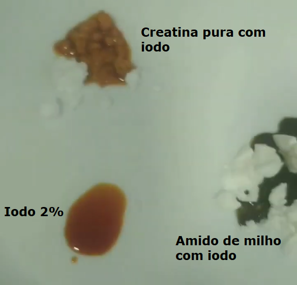

# Teste de Pureza da Creatina

Teste para validar se a creatina é realmente pura.

Este teste só é válido em creatinas que **não possuem carboidrato** em sua composição, ou seja, válido somente para **creatinas que se dizem puras**. Caso possua carboidrato em sua composição  (o que deve constar na tabela nutricional do produto), o teste não terá validade.

## Itens necessários

- Creatina, a ser testada
- Iodo 2% (possível comprar em farmácias)
- Amido de milho (opcional, para melhor comparação)

## Como testar

Em um prato (ou outro recipiente de sua escolha), pingue um pouco de iodo, para analisar sua cor.

Na sequência, coloque uma porção da creatina a ser testada em outra parte do prato, pingue o iodo em cima da creatina e observe a cor que ficou da mistura. Se a cor permaneceu igual ao do iodo, a creatina é pura, se a cor mudou para preta, indica que na composição da creatina possui carboidrato, logo não é pura.

Para uma melhor comparação, coloque uma porção de amido de milho em outra parte do prato e pingue iodo por cima, observe que a cor irá mudar para preta, e será possível comparar melhor com a mistura de creatina com iodo e entender mais facilmente a diferença.

Lembrando que caso a creatina tenha carboidrato em sua composição, a cor ficará preta igual a mistura do amido de milho com iodo.

Para melhor visualização desse teste, veja os vídeos do YouTube abaixo: 
**Shorts YouTube:** [CREATINA FALSIFICADA - Teste Caseiro](https://www.youtube.com/shorts/EDLHcdwwxp0) 

Caso o link do Shorts esteja indisponível, acesse o vídeo através do link secundário: [CREATINA FALSIFICADA - Teste Caseiro](https://drive.google.com/file/d/1_COrFwkPXgmy3bJlIAQD-uMxBQJhh6wA/view?usp=share_link) 

**Vídeo YouTube:** [TESTE DE IODO COM CREATINA ADULTERADA](https://youtu.be/6z9CQ_iCpUc) 

A imagem abaixo foi extraída do Shorts do YouTube (primeiro link acima):

<h1 align="center"> 
	
</h1>